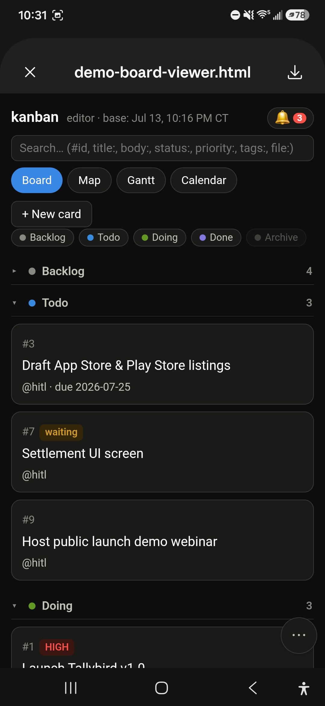
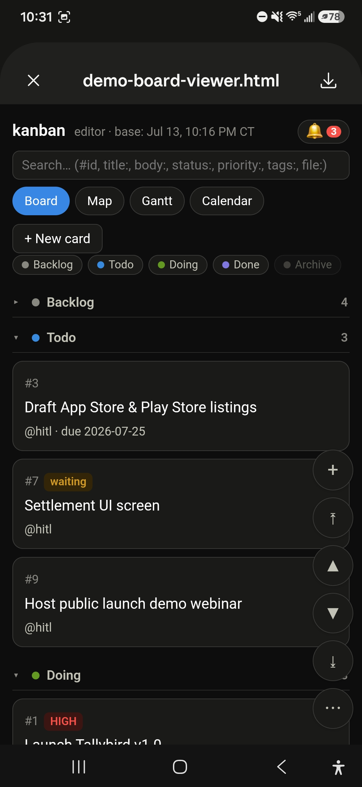
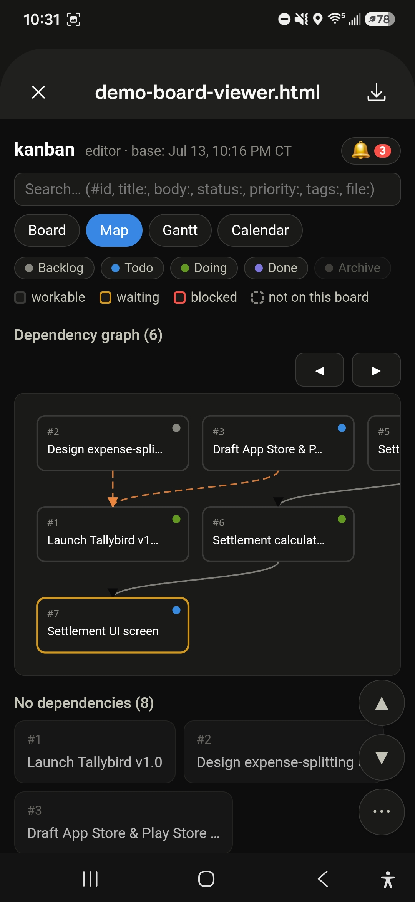
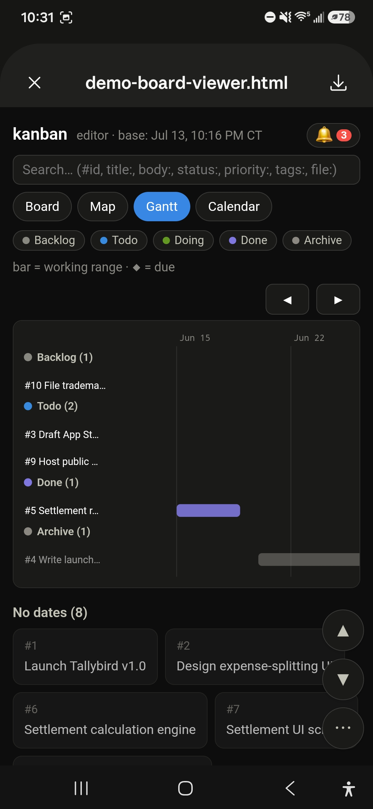
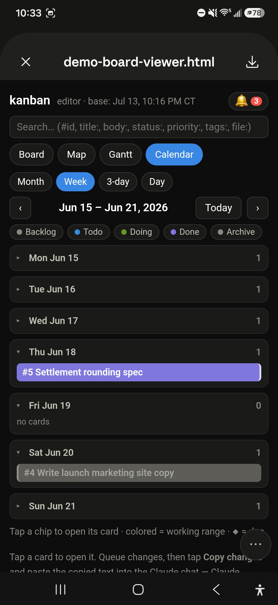
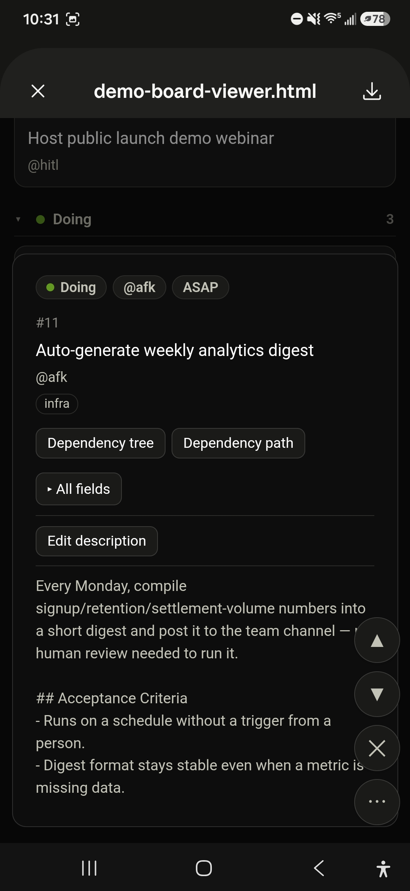
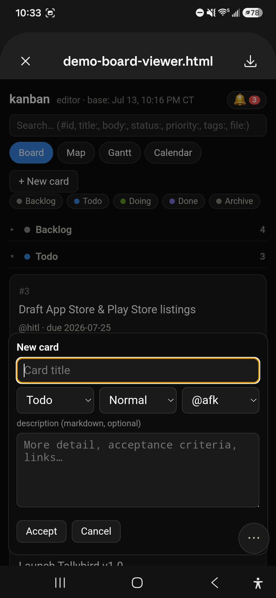
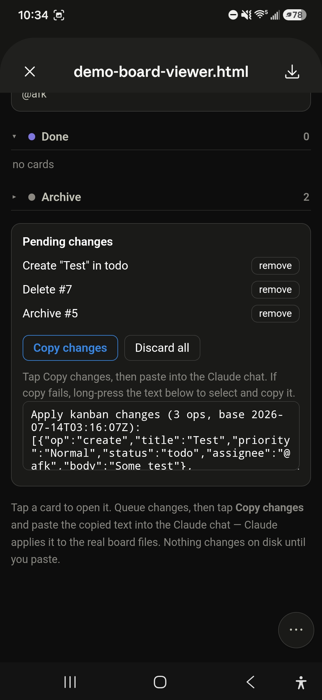

# The mobile viewer

`kanban-viewer` is the surface for editing the board where `kanban-web` can't
reach — a phone, a tablet, or a remote Claude session. It generates a **single,
self-contained HTML file** (no server, everything inlined) that you open and
tap through. It's read-write but **indirect**: nothing touches disk until you
paste a change payload back to Claude, who applies it under the board's write
contracts. That keeps the write path — and the `doing` gate, id allocation, and
archive rules — in one place.

## Generate it

From the repo root:

```bash
python3 skills/viewer/scripts/build_editor.py examples/demo-board --out editor.html
```

Then open `editor.html` on the device you want to edit from (or send it to your
phone). The screenshots below are the bundled `examples/demo-board` on a phone.

## Board



Status sections start **collapsed** — name and count only — so the board opens
as a compact overview; tap a section to expand it. A status-pill row filters
what's shown (Archive is off by default), the tabs switch between Board / Map /
Gantt / Calendar, and the header carries search and a notifications bell. Cards
show the same cues as the desktop board — here `#7` wears the amber **waiting**
tag.

## Getting around



Phones swipe-dismiss an HTML preview, so the viewer ships a fixed
**scroll-button stack** in the corner (it doubles as the context menu): jump to
top/bottom, page up/down, add a card, and a `⋯` that cycles how much of the
stack is shown. It's how you move around without the page scrolling out from
under you.

## The other views

The same three extra views as the desktop app, rendered read-only here and
laid out for a narrow screen:


*Map — the `waiting_for` graph with a workable / waiting / blocked / not-on-board legend; the epic's membership edges are orange.*


*Gantt — working-range bars and due diamonds, grouped by status, with an undated-cards row below.*


*Calendar — Month / Week / 3-day / Day sub-views; the sub-month views are tap-friendly day rows with counts.*

## A card up close



Tapping a card opens its sheet in place: a status / assignee / priority pill row
(tap a pill to edit that field), the description, an **All fields** grid for
everything else (dates, tags, `waiting_for`, and any custom frontmatter), and
**Dependency tree / path** buttons that narrow every view down to that card's
dependency web (no view switch — whatever view you're on just filters to it).

## Creating a card



**+ New card** opens the same sheet in create mode — title, status, priority,
assignee, and an optional description — and nothing joins the board until you
tap **Accept**.

## The change loop



Every move, edit, create, archive, or delete you make **queues** into a
*Pending changes* tray instead of writing to disk. When you're done, tap **Copy
changes** and paste the result into the Claude chat — it looks like:

```
Apply kanban changes (3 ops, base 2026-07-14T03:16:07Z):
[{"op":"create","title":"Test","priority":"Normal","status":"todo", … }, … ]
```

Claude applies each op to the real `*.card.md` files, enforces the board
contracts, reports what it did, and can hand you a fresh editor to keep going.
The `base` timestamp is a conflict guard: if the board moved on since the editor
was generated, Claude reconciles rather than clobbering. Nothing changes on disk
until you paste.

---

For editing at a desktop, see the **[web editor](web.md)**.
