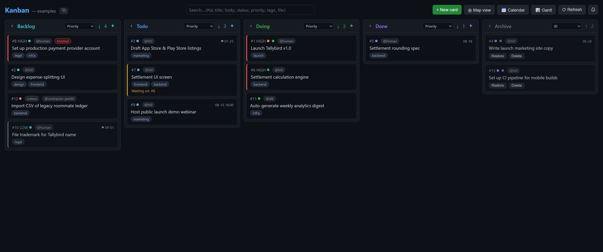
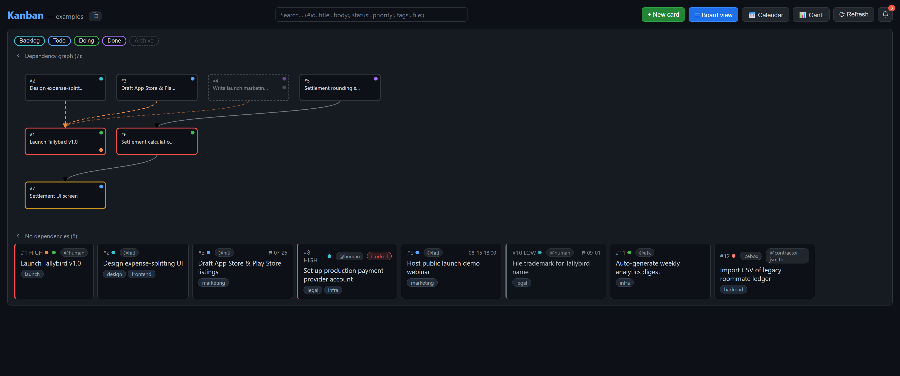
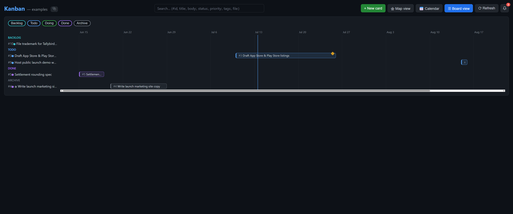
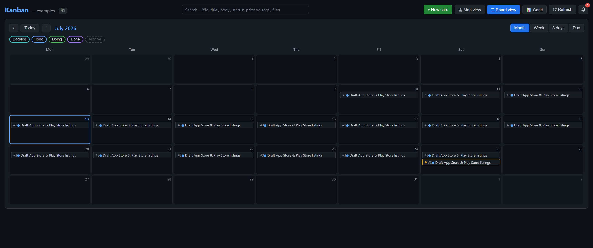
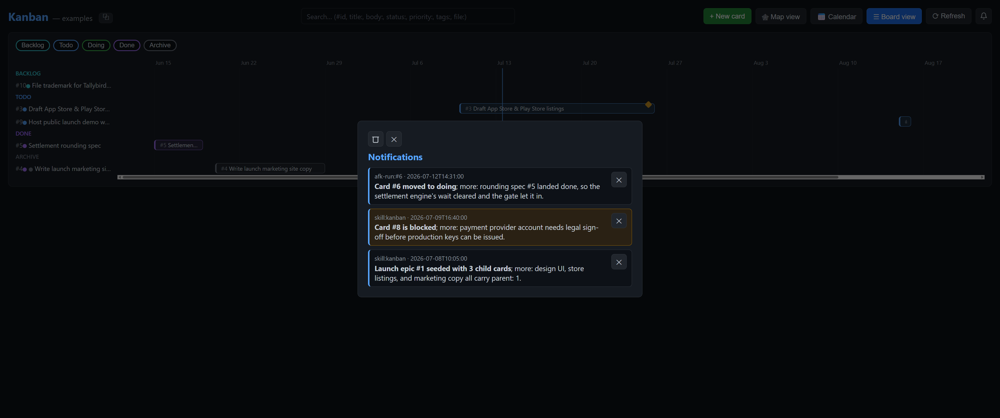
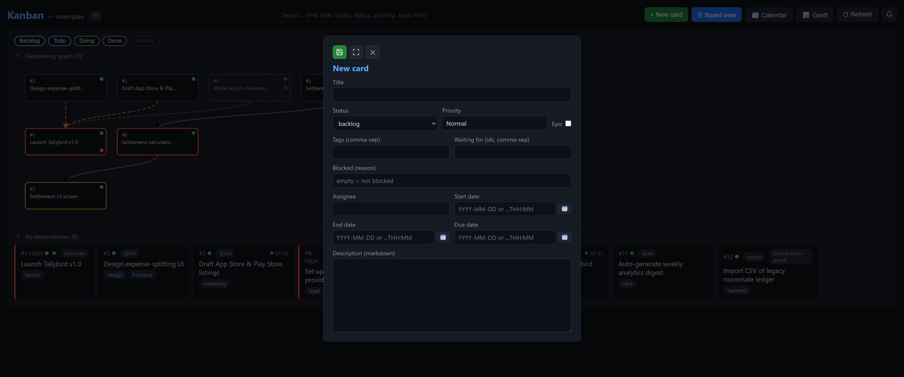
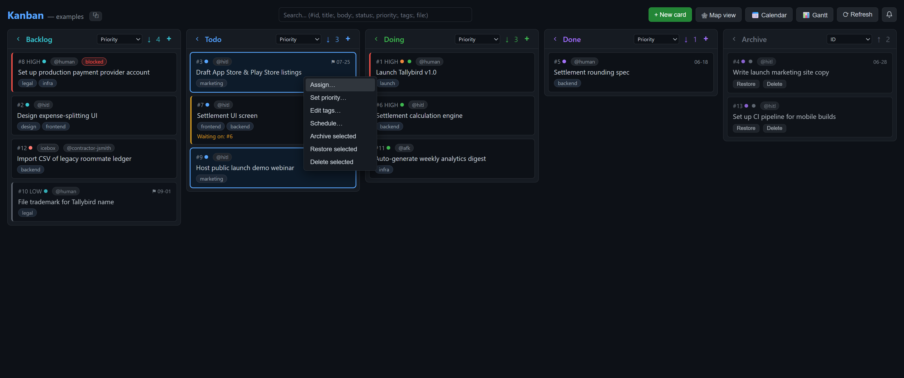

# The web editor (desktop)

`kanban-web` is the human's live editing surface: a localhost Node server
(Node standard library only — no `node_modules`, no build step) serving a
vanilla-JS single-page app. Every drag, edit, and create writes straight back
to the `*.card.md` files, so the folder stays the single source of truth.
Desktop / localhost only — see [ADR 0002](adr/0002-kanban-app-local-server-spa.md).

## Launch

From the repo root:

```bash
node skills/web/scripts/server.js examples/demo-board
```

It prints `Kanban app: http://localhost:7777` (the next free port if 7777 is
busy) and binds to `127.0.0.1` only. Open that URL in any browser, or paste it
into VSCode's **Simple Browser**. Point the command at any folder of
`*.card.md` files to edit your own board.

All the screenshots below are the bundled `examples/demo-board` (a fictional
"Tallybird" app launch).

## Board



The columns are driven by `config.yaml`'s `statuses` list (default
`backlog → todo → doing → done`), with **Archive** always pinned at the far
right. Drag a card between columns to move it; drop it on **doing** and the
entry gate refuses it if the card is **waiting** (a `waiting_for` dependency
isn't `done` yet) or **blocked** (a manual sticker). The tile cues you see:

- a **red left accent** on a High-priority card (`#1`, `#8`),
- an amber **"Waiting on: #6"** badge (`#7` can't start until `#6` lands),
- a red **blocked** pill (`#8`),
- an orange **epic** dot (`#1` is the launch epic),
- the assignee (`@human` / `@hitl` / `@afk`), tags, and due date.

Each column header carries a sort dropdown (id / priority / due / last-modified
/ assignee), a collapse toggle, and a `+` to create a card straight into that
column. The search box up top filters every view at once.

## Dependency map



The **🕸 Map view** lays out `waiting_for` edges as a graph — arrows point from
the card you depend on to the card that's waiting. An **epic** is the sink: it
sits *below* its children and closes only when they do, with its membership
edges tinted orange. Cards with no dependencies drop into a separate row below.
A status-filter pill row (left-click to toggle, right-click to solo) and the
search box both prune the graph.

## Gantt



The **📊 Gantt** view is a day-granular timeline grouped by status: each dated
card is a **bar** for its working range (`start_date → end_date`) and/or an
amber **diamond** for its `due_date`. Drag a bar to reschedule, drag an edge to
resize, drag the diamond to move the deadline. The Archive pill (off by
default) folds dated archived cards in as a trailing group.

## Calendar



The **📅 Calendar** view is a Monday-start month grid (with Week / 3-day / Day
sub-views). Working ranges render as linked chips; a `due_date` is its own
amber ⚑ deadline chip. Drag a chip to move the range or the deadline. Same
status-filter pills and search as the other views.

## More on the board

**Notifications inbox** — the header bell surfaces messages agents leave in
`notifications.md`: a bolded TLDR, a level tint (debug / info / warning /
error), and per-entry archiving.



**Create & edit** — a minimal-first form (just a title and assignee) that
expands to the full field set — status, priority, epic, tags, `waiting_for`,
blocked reason, the date triad, and a Markdown description.



**Bulk actions** — select cards (click, ctrl-click, shift-click) and
right-click for a context menu: assign, set priority, edit tags, schedule,
archive, restore, delete, or focus a dependency tree/path. The same selection
grammar works in every view.



## Other surfaces

The **[CLI](cli.md)** is this editor's conversational twin — the same
operations and rules, driven by chat instead of a browser, so it works at a
bare terminal or under remote control. The **[mobile viewer](viewer.md)** is
the tap-through board for a phone or tablet. See [`CONTEXT.md`](../CONTEXT.md)
for the full parity table across every surface.
